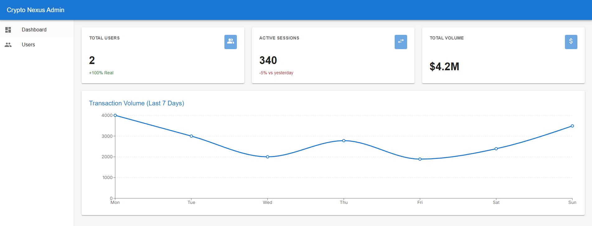
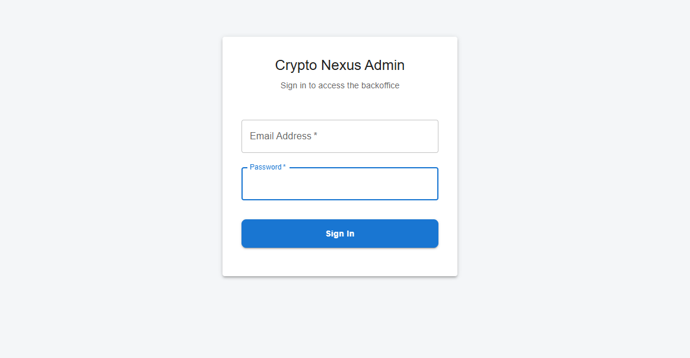
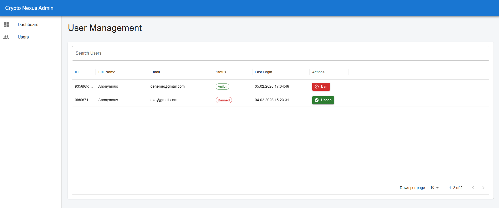
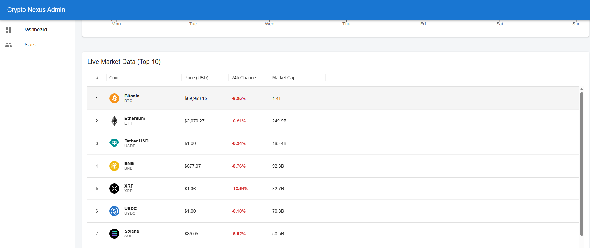

# Crypto Nexus - Backoffice Management System



## 📋 About the Project

This project is a modern **Backoffice Management System** designed for the **Crypto Tracking** mobile application. It allows administrators to manage real registered users, control system access (Ban/Unban functionality), and monitor live cryptocurrency market data.

Built with **Next.js 14 (App Router)**, the system prioritizes security, scalability, and a seamless user experience using modern web architecture standards.

### 🔗 Links

- **🚀 Live Demo:** [INSERT_VERCEL_LINK_HERE]
- **📱 Related Mobile Project:** [[Mobile-Crypto-Tracking-App](https://github.com/altundalyusuf/Mobile-Crypto-Tracking-App)]

---

## 🛠️ Tech Stack

This project goes beyond basic implementation, utilizing an **Enterprise-level** stack to ensure robustness and security.

- **Framework:** Next.js 14 (App Router)
- **Language:** TypeScript
- **State Management:** Redux Toolkit (with Async Thunks)
- **Backend & Auth:** Supabase (Auth, Database & Admin API)
- **Styling:** Material UI (MUI)
- **Data Fetching:** Server Actions & REST API (Coinranking)
- **Security:** Next.js Middleware & Supabase SSR

---

## 💡 Key Architectural Decisions

_Highlights of the engineering challenges solved and architectural choices made in this project:_

### 1. Security & Middleware (The Gatekeeper)

Client-side redirects are insufficient for admin security. This project implements **Next.js Middleware** to intercept requests at the server level.

- **Supabase SSR:** Utilizes HttpOnly cookies for secure session management.
- **Protected Routes:** Unauthorized users are blocked at the edge before the page renders and redirected to login.

### 2. Server Actions for Database Mutations

Instead of exposing sensitive API keys via client-side REST calls, **Server Actions** are used for critical operations like banning users.

- **Why?** It keeps the `SUPABASE_SERVICE_ROLE_KEY` strictly on the server, preventing privilege escalation attacks.

### 3. Solving Race Conditions (Async Synchronization)

To prevent "UI Glitches" (e.g., a button flashing the old state after a click), the project uses **Redux Toolkit** methods.

### 4. Hybrid Data Architecture

- **Real Data:** User management (Supabase Auth) and Market Data (Coinranking API) operate on live production data.
- **Simulation:** Transaction volume charts utilize simulated data to demonstrate frontend visualization capabilities (Recharts) pending the integration of a transaction ledger.

---

## 📸 Screenshots

### 1. Secure Login

Authentication with error handling and secure session establishment.


### 2. User Management (Interactivity)

Real-time searching, status monitoring, and Server-Side Ban/Unban actions.


### 3. Dashboard & Market Tracking

Live crypto metrics and analytical summaries.


### 4. Live Market Data

Live crypto metrics with top 10 coins.


---

## 🚀 Getting Started (Local Development)

Follow these steps to run the project locally:

1. **Clone the repository**

2. **Install dependencies:**

   ```bash
   npm install
   ```

3. **Configure Environment Variables: Create a .env.local file in the root directory and add your Supabase credentials:**

   ```bash
   NEXT_PUBLIC_SUPABASE_URL=your_supabase_url
   NEXT_PUBLIC_SUPABASE_ANON_KEY=your_anon_key
   SUPABASE_SERVICE_ROLE_KEY=your_service_role_key
   ```

4. **Run the development server:**

   ```bash
   npm run dev
   ```

5. **Run the development server:**
   Open your browser: Navigate to http://localhost:3000 to view the application.
